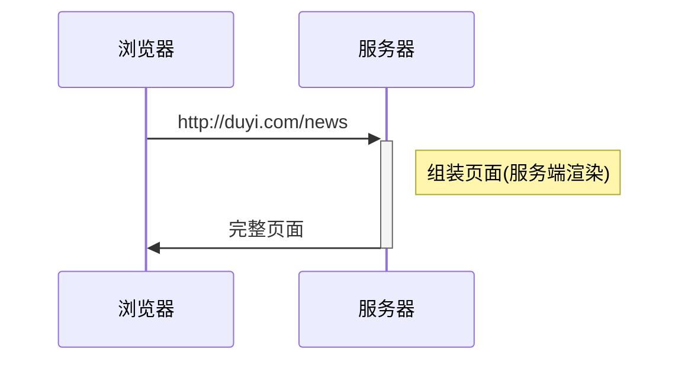
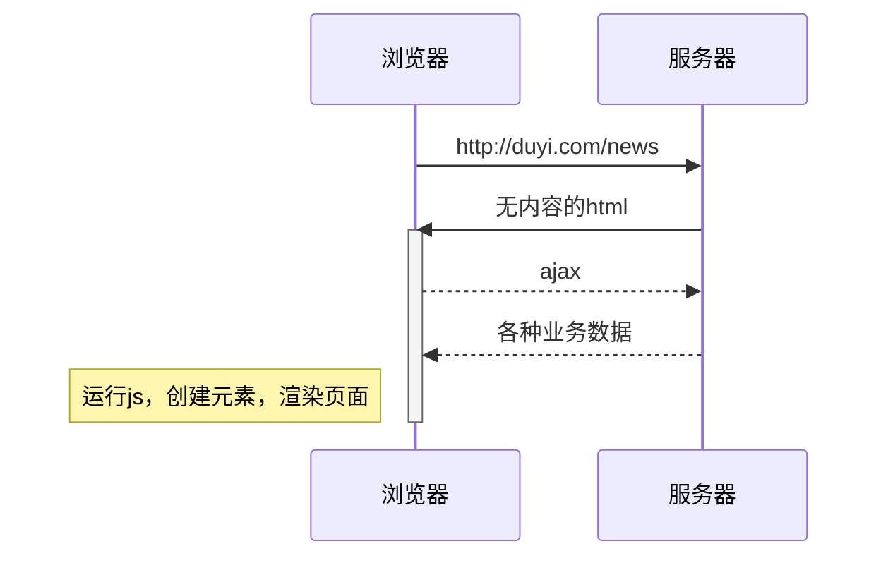
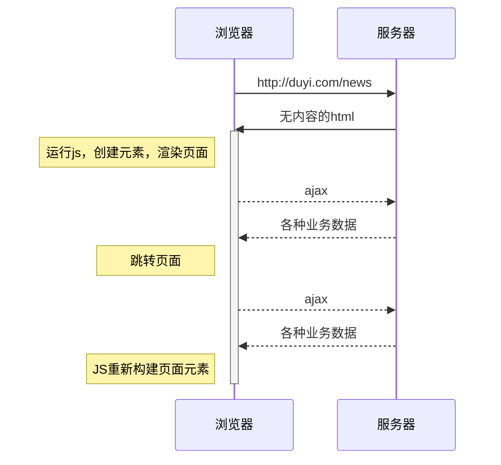
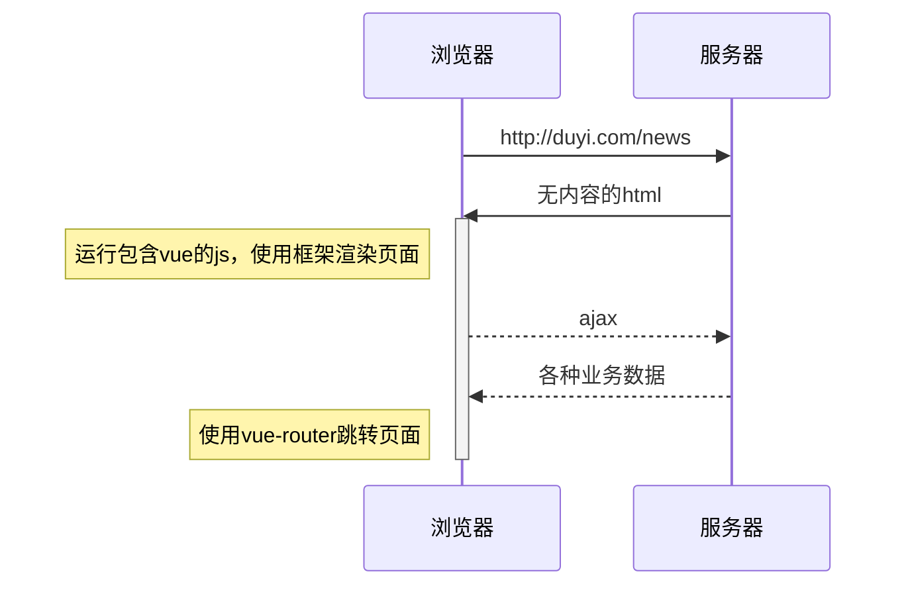

> vue官网：https://cn.vuejs.org/

**服务端渲染**

```mermaid
sequenceDiagram
浏览器->>+服务器: http://duyi.com/news
Note right of 服务器: 组装页面(服务端渲染)
服务器->>-浏览器: 完整页面
```

------

**前后端分离**

```mermaid
sequenceDiagram
浏览器->>服务器: http://duyi.com/news
服务器->>浏览器: 无内容的html
activate 浏览器
浏览器-->>服务器: ajax
服务器-->>浏览器: 各种业务数据
Note left of 浏览器: 运行js，创建元素，渲染页面
deactivate 浏览器
```

---------

**单页应用**

```mermaid
sequenceDiagram
浏览器->>服务器: http://duyi.com/news
服务器->>浏览器: 无内容的html
activate 浏览器
Note left of 浏览器: 运行js，创建元素，渲染页面
浏览器-->>服务器: ajax
服务器-->>浏览器: 各种业务数据
Note left of 浏览器: 跳转页面
浏览器-->>服务器: ajax
服务器-->>浏览器: 各种业务数据
Note left of 浏览器: JS重新构建页面元素
deactivate 浏览器
```

---------

**vue框架**

```mermaid
sequenceDiagram
浏览器->>服务器: http://duyi.com/news
服务器->>浏览器: 无内容的html
activate 浏览器
Note left of 浏览器: 运行包含vue的js，使用框架渲染页面
浏览器-->>服务器: ajax
服务器-->>浏览器: 各种业务数据
Note left of 浏览器: 使用vue-router跳转页面
deactivate 浏览器
```

