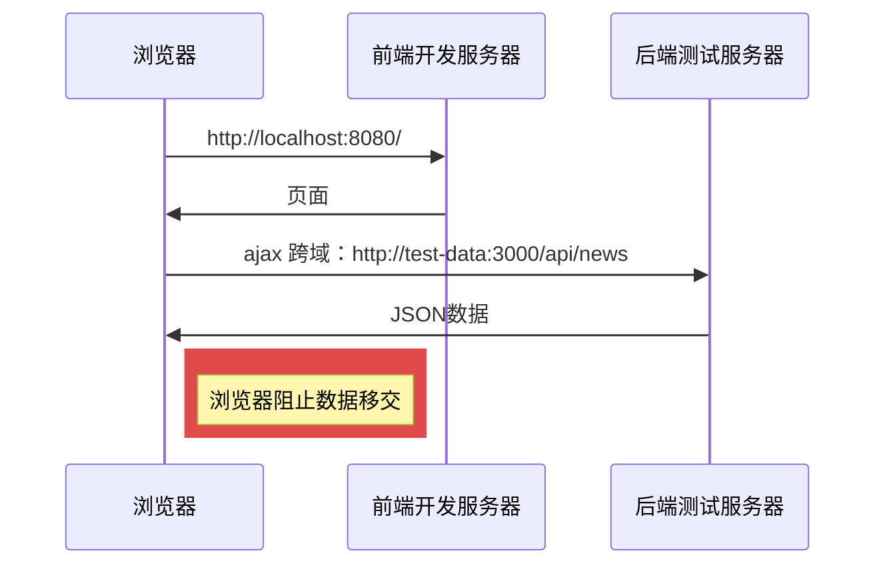
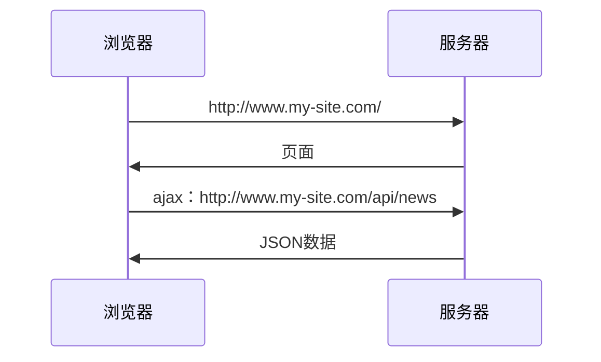
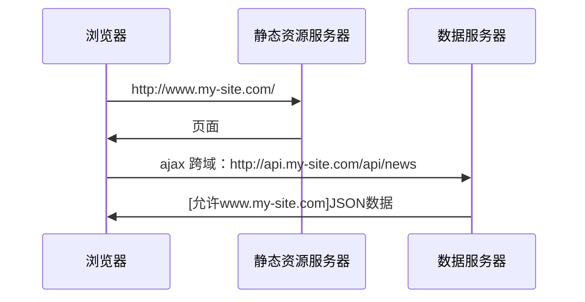
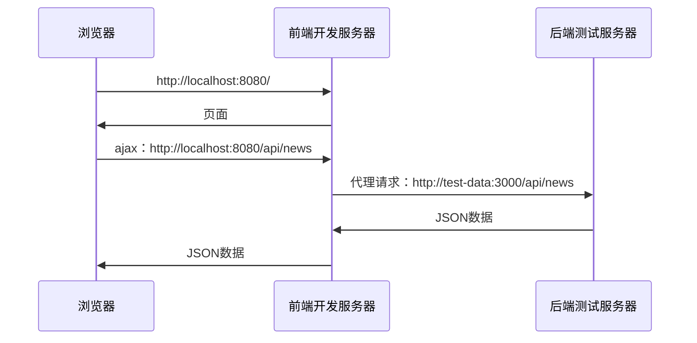
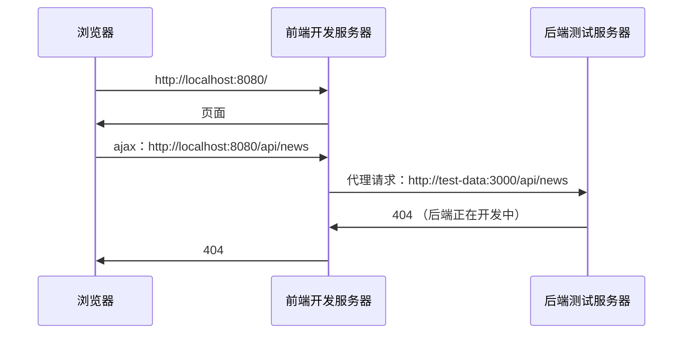
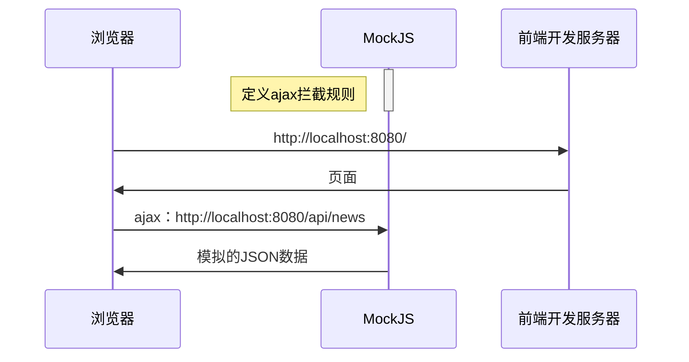

> 本节课内容和vue没有任何关系！
>
> vue cli: https://cli.vuejs.org/zh/
>
> axios: https://github.com/axios/axios
>
> mockjs：http://mockjs.com/

# 远程获取数据的意义

# 开发环境有跨域问题

# 生产环境没有跨域问题

# 解决开发环境的跨域问题

# 为什么要Mock数据

